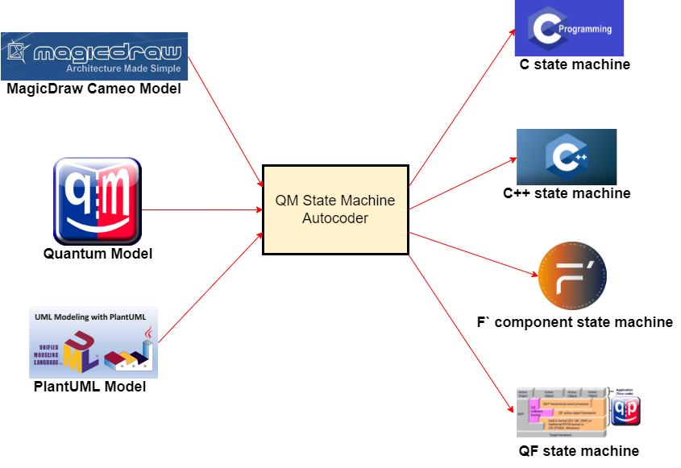
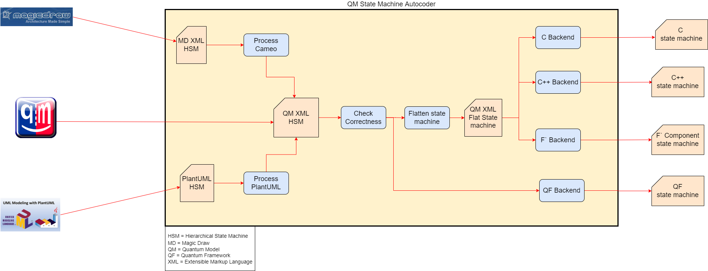

# QMAutocoder
Quantum Modeling State-machine Autocoder

This repository contains the current development for the QM State Machine Autocoder.
The Autocoder is developed in Python.  The code that is generated is safe and simple and can be used in embedded real time applications.

State machine models may be specified using any of these modeling tools: +
1) MagicDraw Cameo Systems Modeler +
2) Quantum Modeler +
3) PlantUML text +

The Autocoder processes the model into any one of the following: +
1) C state machine code +
2) C++ state machine code +
3) F` component state machine code +
4) Quantum Framework state machine code +

The Quantum Modeler tool is a free open source application for Windows, Linux or Mac that can be downloaded from:
https://www.state-machine.com/#Downloads

F` is an open source Component Flight Software framework which can be downloaded from:
https://github.com/nasa/fprime

This diagram highlights the design and process flow of the QM State Machine Autocoder:

For using the PlantUML, see the users guide:
link:PlantUML_UsersGuide.adoc[]

Check out some other cool code:
link:models/TestModels/simple/Simple.plantuml[]

## Using the Quantum Modeler:
To start your first state-machine model, the easiest way is to open up an existing model 
ie Open up models/TestModels/simpl/Simpl.qm and just rename the model.

Otherwise this is the procedure: +
- From the File pull down menu, select 'New Model' +
- In the Model Template, select None +
- In the Framework, select qpc +
- Highlight 'model' in the Model Explorer, right click and Add Package +
- Highlight 'package', right click and Add Class +
- In the Property Editor, rename 'Class1' with the name of your state machine (ie 'MySm') +
- In the Property Editor, in the superclass, select 'qpc::QHsm' +
- In the Model Explorer, right click the named state machine (ie 'MySm:QHsm') and Add State Machine +
- In the Model Explorer, double click the SM icon +
- Expand the drawing canvas +
- On right hand side, select the state icon, move to the canvas and click to drop it in. +

The QMAutocoder outputs code with the following design patterns: +
- C++ flattened state-machine +
- C flattened state-machine  +
- C Quantum Framework +
- Fprime +

The Python State-machine Autocoder uses the following Python modules.  +
Install these modules on your system before invoking the Autocoder:

[cols="1,1"]
|===
|Package |Version

|Cheetah3
|3.2.6.post1

|iteration-utilities 
| 0.11.0

|lxml 
|4.6.3

|anytree
|2.8.0

|pip  
|21.0.1

|setuptools 
|41.2.0
|===

The Python state-machine Autocoder command syntax: +
usage: QMAutocoder.py [-h] [-noImpl] [-noSignals] [-namespace NAMESPACE] {c,qf,c++,fprime} model +

State-machine Autocoder.

positional arguments: +
  {c,qf,c++,fprime}     back-end code to generate +
  model                 QM state-machine model file: <model>.qm +

optional arguments: +
  -h, --help            show this help message and exit +
  -noImpl               Don't generate the Impl files +
  -noSignals            Don't generate the Signals header file for the qf backend +
  -namespace NAMESPACE  Namespace for the fprime backend +

To Invoke the Autocoder on a model specified with the QM tool:

Examples +
cd models/Blinky

C backend Example: +
../../autocoder/QMAutocoder.py c -noImpl Blinky.qm

Cplusplus backend Example: +
../../autocoder/QMAutocoder.py c++ -noImpl Blinky.qm

qf backend Example: +
../../autocoder/QMAutocoder.py qf -noImpl Blinky.qm

fprime backend Example: +
../../autocoder/QMAutocoder.py fprime -noImpl -namespace BLINKY Blinky.qm

## Build and run all the unit tests

make +
make ut +

## To run from a Docker image
First build the image: +
- cd docker +
- docker build -it qm . +
Then run docker: +
- cd .. +
- ./docker/run_container.sh +

