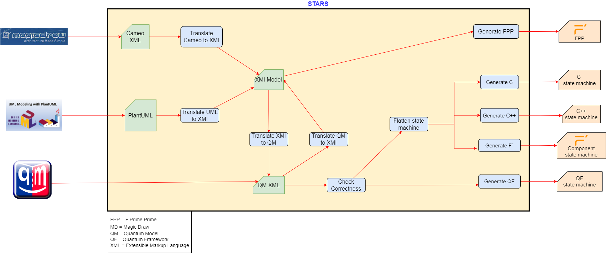

# STARS

STARS (State Autocoding for Real time Systems) is an innovative software tool designed to streamline and optimize the development of embedded real-time applications. Leveraging state-of-the-art autocoding technology, Stars transforms state-machine models into efficient, reliable, and maintainable code, suitable for a wide range of applications. Developed with a focus on user-friendliness and versatility, it supports multiple modeling tools and generates code in C or C++ and specifically generates code for two different frameworks - the F` framework and the Quantum Framework, addressing the diverse needs of developers and engineers. By automating the code generation process, Stars not only accelerates development cycles but also significantly reduces the potential for human error, ensuring higher quality and performance in the final product. Whether you are working on small-scale projects or complex embedded systems, Stars is engineered to enhance productivity and foster innovation in your development endeavors.

State machine models may be specified using any of these modeling tools: +
1) MagicDraw Cameo Systems Modeler +
2) Quantum Modeler +
3) PlantUML text +

The Autocoder processes the model into any one of the following: +
1) C state machine code +
2) C++ state machine code +
3) F` component state machine code and F` FPP +
4) Quantum Framework state machine code +

## Interface and Design

This diagram highlights the input models (front end) and the autocoder products (back end)

This diagram highlights the design and process flow of the QM State Machine Autocoder:

## Installation and checkout
- Install the Python module:
....
pip install -r requirements.txt
....

- Check that it all works by building and running the test models
....
make
make ut
....

## Model Tool Support

### Quantum Modeler

The Quantum Modeler tool is a free open source application for Windows, Linux or Mac that can be downloaded from:
https://www.state-machine.com/#Downloads

The full users guide is here:
https://www.state-machine.com/qm/bm_diagram.html

But the quick approach is to to open up an existing model 
ie Open up link:models/TestModels/simple/Simple.qm[] and just rename the model.

Otherwise this is the procedure: +
- From the File pull down menu, select 'New Model' +
- In the Model Template, select None +
- In the Framework, select qpc +
- Highlight 'model' in the Model Explorer, right click and Add Package +
- Highlight 'package', right click and Add Class +
- In the Property Editor, rename 'Class1' with the name of your state machine (ie 'MySm') +
- In the Property Editor, in the superclass, select 'qpc::QHsm' +
- In the Model Explorer, right click the named state machine (ie 'MySm:QHsm') and Add State Machine +
- In the Model Explorer, double click the SM icon +
- Expand the drawing canvas +
- On right hand side, select the state icon, move to the canvas and click to drop it in. +

Here are some examples of QM state machine models that are parsed correctly by this Autocoder:

link:models/TestModels/simple/Simple.qm[Simple.qm] +
link:models/TestModels/simple_composite/Simple_Composite.qm[Simple_Composite.qm] +
link:models/TestModels/cases/Cases.qm[Cases.qm] +
link:models/TestModels/Cameo/Cameo.qm[Cameo.qm] +
link:models/TestModels/actions/Actions.qm[Actions.qm] +
link:models/TestModels/complex_junction/Complex_Junction.qm[Complex_Junction.qm] +
link:models/TestModels/simple_junction/Simple_Junction.qm[Simple_Junction.qm] +
link:models/TestModels/multiple_actions/Multiple_Actions.qm[Multiple_Actions.qm] +
link:models/TestModels/arg_actions/Arg_Actions.qm[Arg_Actions.qm] +
link:models/TestModels/transitions/Transitions.qm[Transitions.qm] +
link:models/TestModels/string_guards/String_Guards.qm[String_Guards.qm] +
link:models/TestModels/simple_junction/Simple_Junction.qm[Simple_Junction.qm] +

### PlantUML

For using the PlantUML, see the users guide:

link:PlantUML_UsersGuide.adoc[]

Here are some examples of PlantUML state machine models that are parsed correctly by this Autocoder:

link:models/TestModels/simple/Simple.plantuml[Simple.plantuml] +
link:models/TestModels/simple_composite/Simple_Composite.plantuml[Simple_Composite.plantuml] +
link:models/TestModels/cases/Cases.plantuml[Cases.plantuml] +
link:models/TestModels/Cameo/Cameo.plantuml[Cameo.plantuml] +
link:models/TestModels/actions/Actions.plantuml[Actions.plantuml] +
link:models/TestModels/complex_junction/Complex_Junction.plantuml[Complex_Junction.plantuml] +
link:models/TestModels/simple_junction/Simple_Junction.plantuml[Simple_Junction.plantuml] +
link:models/TestModels/multiple_actions/Multiple_Actions.plantuml[Multiple_Actions.plantuml] +
link:models/TestModels/arg_actions/Arg_Actions.plantuml[Arg_Actions.plantuml] +
link:models/TestModels/transitions/Transitions.plantuml[Transitions.plantuml] +
link:models/TestModels/string_guards/String_Guards.plantuml[String_Guards.plantuml] +
link:models/TestModels/simple_junction/Simple_Junction.plantuml[Simple_Junction.plantuml] +

Diagrams can be generated from PlantUML models: +
Example: +
For the Blinky model:
....
@startuml

[*] --> Off: /Bsp_Initialize()

state Off {
    Off:Entry: Bsp_LED_TurnOff()
}

state On {
    On:Entry: Bsp_LED_TurnOn()
}

Off --> On : TIMEOUT
On --> Off : TIMEOUT
@enduml
....

Issue the Command:
....
python -m plantuml Blinky.plantuml
....
Will generate the following graphic:

image::models/Blinky/BlinkyUML.png[alt="Blinky PlantUML"]

### MagicDraw Cameo
MagicDraw is not a free tool.  If you have a license then you should also have the documentation.
MagicDraw is a complex tool and there are many ways to specify a state machine that looks correct but
will not be parsed correctly by this Autocoder.  Here are some example models that do parse correctly: +
- models/TestModels/simple/Simple.xml +
- models/TestModels/simple_composite/Simple_Composite.xml +
- models/TestModels/cases/Cases.xml +
- models/TestModels/Cameo/Cameo.xml +
- models/TestModels/actions/Actions.xml +
- models/TestModels/complex_junction/Complex_Junction.xml +
- models/TestModels/simple_junction/Simple_Junction.xml +
- models/TestModels/multiple_actions/Multiple_Actions.xml +
- models/TestModels/arg_actions/Arg_Actions.xml +
- models/TestModels/transitions/Transitions.xml +
- models/TestModels/string_guards/String_Guards.xml +
- models/TestModels/simple_junction/Simple_Junction.xml +

## F`
F` is an open source Component Flight Software framework which can be downloaded from:
https://github.com/nasa/fprime

The interface between a state machine that is generated with the F` backend is as follows: +
If `SignalGen` is an F` component and `Simple` is the state-machine, then the autocoder will
generate an interface class called `SimpleIf` and a class called `Simple`.  The relationships are
illustrated in this diagram:

image::ClassDiagram.png[alt="Class Diagram"]

This relationship allows the state machine implementation functions to be defined in the implementation component class. +

Here is the component header class that shows the interface.  
In this example `Simple_s1Entry()` is a state machine implementation function. 

....
class SignalGen : public SimpleIf {
  public:
      Simple sm;

      SignalGen() : sm(this) {}

      void init();

      void Simple_s1Entry() override;
};
....

## Command Syntax
The Python state-machine Autocoder command syntax: +

usage: Stars.py [-h] [-backend {c,qf,c++,fprime}] [-model MODEL] [-noImpl] [-noSignals] [-namespace NAMESPACE] [-debug] [-smbase]

State-machine Autocoder.

[options="State machine Autocoder"]
|===
|   switch     | argument | deescription
|  -h, --help  |           | show this help message and exit +
|   -backend   | c, qf, c++, fprime  | back-end code to generate +
|   -model     |   MODEL   | QM state-machine model file: <model>.qm +
|   -noImpl    |           | Don't generate the Impl files +
|   -noSignals |           | Don't generate the Signals header file +
|   -namespace | NAMESPACE | Fprime namespace +
|   -debug     |           | prints out the models +
|   -smbase    |           | Generates the component state-machine base class +
|===

## Examples

cd autocoder

### QM Model - C Backend
`./Stars.py -backend c -noImpl -model ../models/Blinky/Blinky.qm`

### PlantUML Model - C++ Backend
`./Stars.py -backend c++ -noImpl -model ../models/Blinky/Blinky.plantuml`

### QM Model - QF Backend
`./Stars.py -backend qf -noImpl -model ../models/Blinky/Blinky.qm`

### PlantUML Model - fprime backend
`./Stars.py -backend fprime -noImpl -namespace BLINKY -model ../models/Blinky/Blinky.plantuml`

### Cameo Model - fprime backend
`./Stars.py -backend fprime -noImpl -namespace BLINKY -model ../models/Blinky/Blinky.xml`

### Generate F` state machine base classes and other F` artifacts
`./Stars.py -smbase`

For other examples see: +

link:models/Blinky/README.adoc[] +
link:models/Device/README.adoc[]

## Test Harness

The test harness provides the capability to test a state machine model by setting guard states and sending events.  +
A graphical rendering of the state machine is updated to animate the state machine.

image::TestHarness.png[alt="STARS Interfaces"]

### Example 

- `cd testharness`

- `cp ../models/TestModels/complex_junction/Complex_Junction.plantuml .`

- `ipython`

- `%run test_harness.py`

- `set_model("Complex_Junction.plantuml")` +
  (Open and view `Complex_Junction.png`)

- `set_guard("g3", "True")`

- `send_event("Ev1")`

