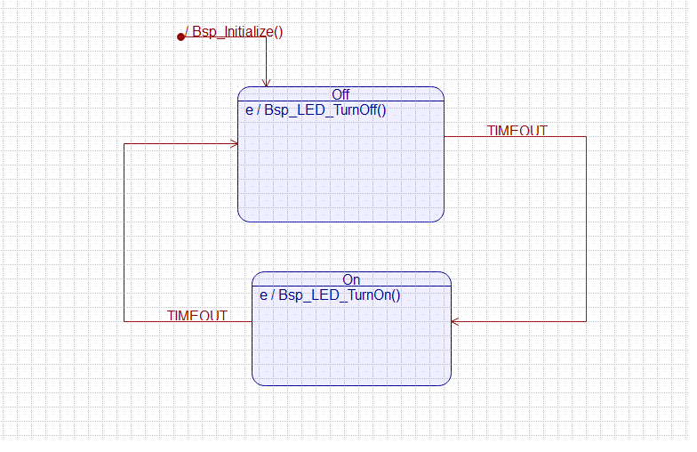

# Blinky Model

The Blinky Model in this directory is specified in:

* QM state machine drawing tool (Blinky.qm)
* PlantUML (Blinky.plantuml)
* MagicDraw Cameo (Blinky.xml)

The output from STARS is in:

* C
* C++
* Fprime
* Quantum Framework (QF)

## Quantum Modeler

## PlantUML

....
@startuml

[*] --> Off: /Bsp_Initialize()

state Off {
    Off:Entry: Bsp_LED_TurnOff()
}

state On {
    On:Entry: Bsp_LED_TurnOn()
}

Off --> On : TIMEOUT
On --> Off : TIMEOUT
@enduml
....

image::BlinkyUML.png[]

* Run the autocoder, build the executable model and run the unit tests 
** make 

