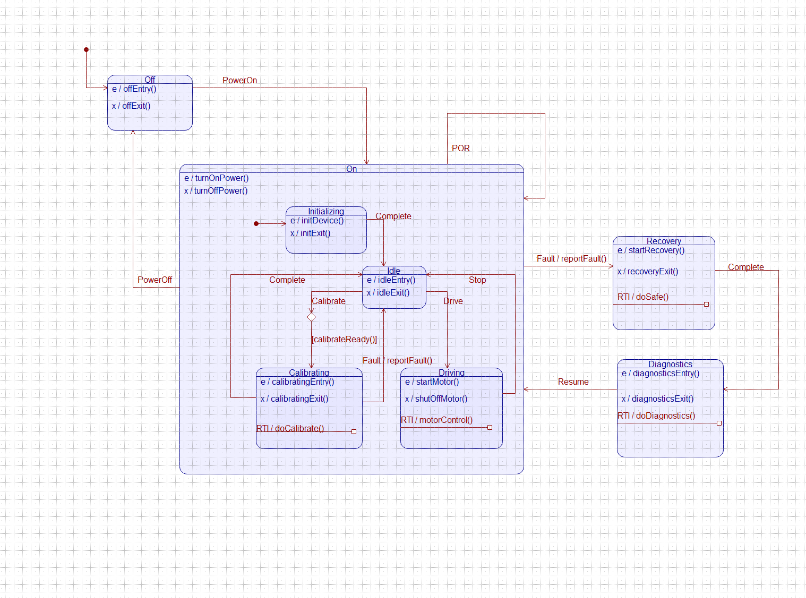
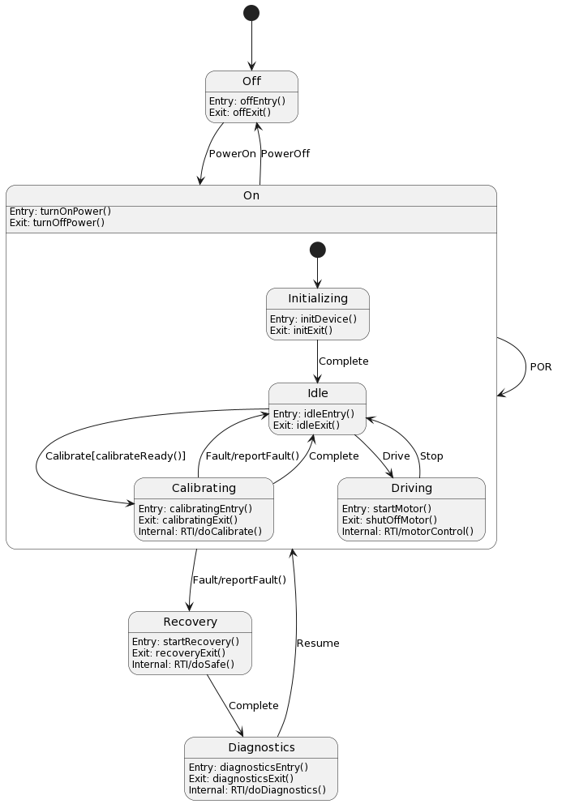

# Device Model

## Quantum Modeler 

## PlantUML

....
@startuml

[*] --> Off

state Off {
    Off:Entry: offEntry()
    Off:Exit: offExit()
}

state On {
    [*] --> Initializing
    On:Entry: turnOnPower()
    On:Exit: turnOffPower()

    state Initializing {
        Initializing:Entry: initDevice()
        Initializing:Exit: initExit()
    }

    state Idle {
        Idle:Entry: idleEntry()
        Idle:Exit: idleExit()
    }

    state Calibrating {
        Calibrating:Entry: calibratingEntry()
        Calibrating:Exit: calibratingExit()
        Calibrating:Internal: RTI/doCalibrate()
    }

    state Driving {
        Driving:Entry: startMotor()
        Driving:Exit: shutOffMotor()
        Driving:Internal: RTI/motorControl()
    }

    Initializing --> Idle: Complete
    Idle --> Driving: Drive
    Idle --> Calibrating: Calibrate[calibrateReady()]
    Calibrating --> Idle: Fault/reportFault()
    Calibrating --> Idle: Complete
    Driving --> Idle: Stop
}

state Recovery {
    Recovery:Entry: startRecovery()
    Recovery:Exit: recoveryExit()
    Recovery:Internal: RTI/doSafe()
}

state Diagnostics {
    Diagnostics:Entry: diagnosticsEntry()
    Diagnostics:Exit: diagnosticsExit()
    Diagnostics:Internal: RTI/doDiagnostics()
}

Off --> On: PowerOn
On --> Off: PowerOff
On --> Recovery: Fault/reportFault()
Diagnostics --> On: Resume
Recovery --> Diagnostics: Complete
On --> On: POR

@enduml

....

* Run the autocoder and build the executable model for C and QF
** make 

* Execute the model using the C back-end
** make run

* Run the unit tests for C and QF
** make ut

* Run the autocoder and build executable model for C
** make C

* Run the autocoder and build executable model for QF
** make QF

 
