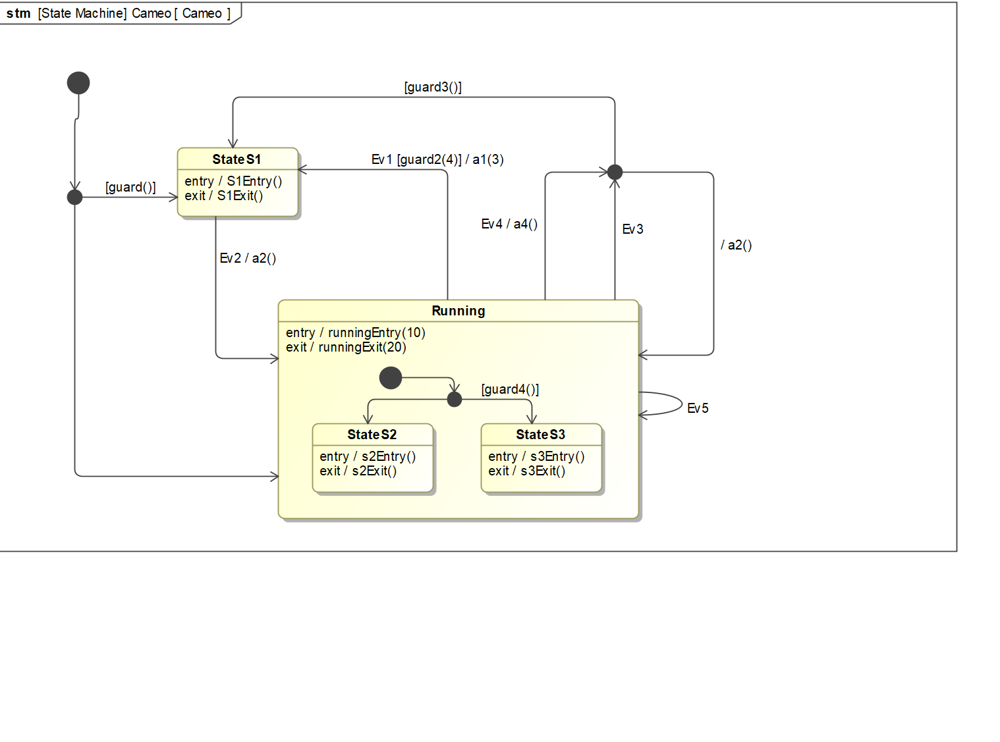
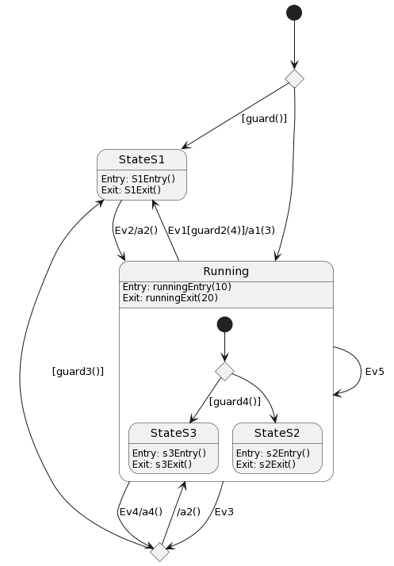

# Cameo Model

## MagicDraw Cameo System Modeler

## PlantUML

....
@startuml
state c1 <<choice>>
state c3 <<choice>>

[*] --> c1
c1 --> StateS1: [guard()]
c1 --> Running

state StateS1 {
    StateS1:Entry: S1Entry()
    StateS1:Exit: S1Exit()
}

state Running {
    state c2 <<choice>>
    [*] --> c2
    c2 --> StateS3: [guard4()]
    c2 --> StateS2
    Running:Entry: runningEntry(10)
    Running:Exit: runningExit(20)
    state StateS2 {
        StateS2:Entry: s2Entry()
        StateS2:Exit: s2Exit()

    }
    state StateS3 {
        StateS3:Entry: s3Entry()
        StateS3:Exit: s3Exit()

    }
}

Running --> Running: Ev5
Running --> c3: Ev4/a4()
c3 --> Running: /a2()
c3 --> StateS1: [guard3()]
Running --> c3: Ev3
Running --> StateS1: Ev1[guard2(4)]/a1(3)
StateS1 --> Running: Ev2/a2()
@enduml
....

* Run the autocoder and build the executable model for C and QF
** make 

* Run the unit tests for C and QF
** make ut

* Run the autocoder and build executable model for C
** make C

* Run the autocoder and build executable model for QF
** make QF

 
