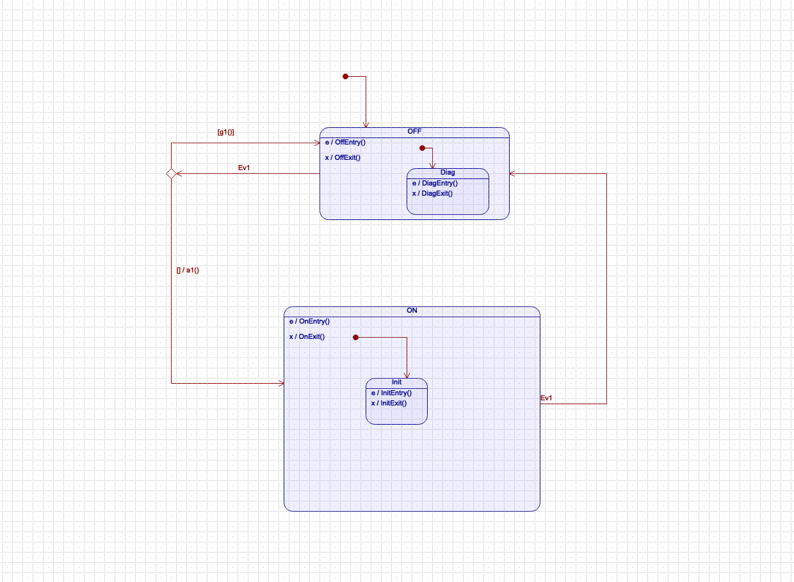

* Run the autocoder and build the executable model for C and QF
** make 

* Run the unit tests for C and QF
** make ut

* Run the autocoder and build executable model for C
** make C

* Run the autocoder and build executable model for QF
** make QF

 
